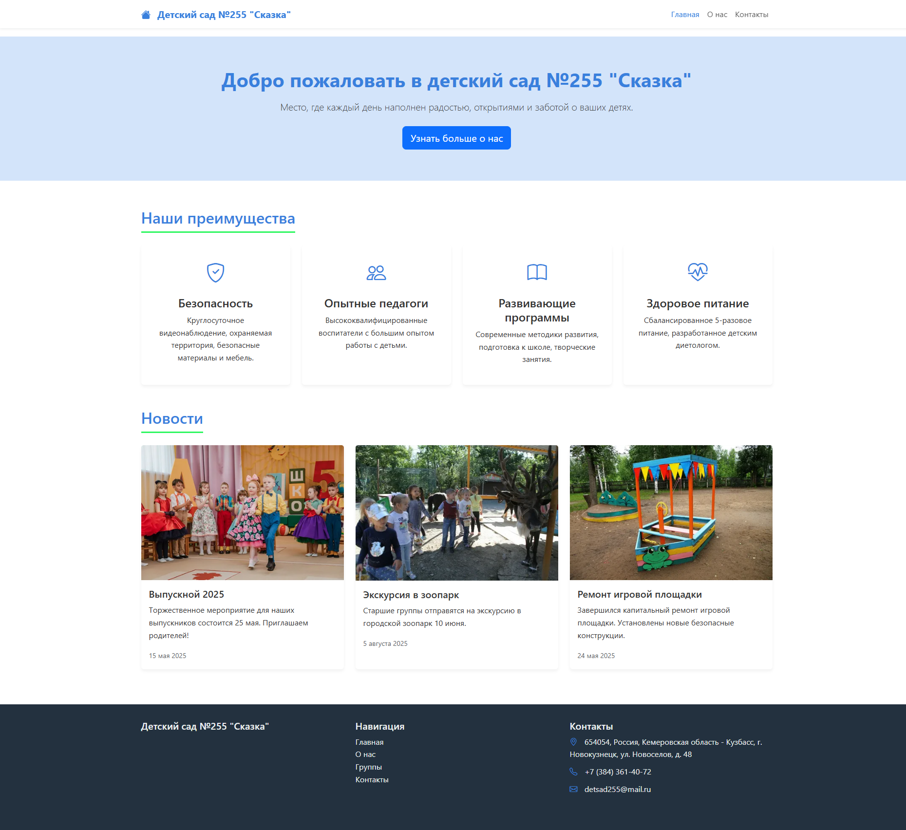
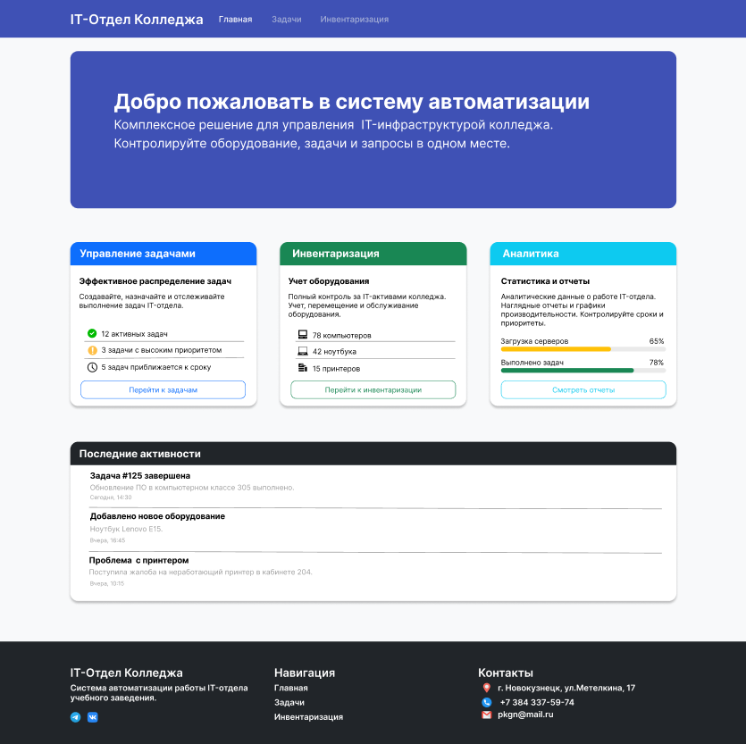

# Лендинг для автошколы (производственная практика) 🏫
 
- [САЙТ](https://sltmlol.github.io/zarulem/)
## 📝 О проекте
Это учебный проект, выполненный в рамках обучения в ГПОУ ПК г. Новокузнецк им. Кучерявенко Т.А. . 
Представляет собой одностраничный сайт (лендинг) для автошколы "За рулем".

## 🛠 Технологии
- HTML5
- CSS
- JavaScript 
- Адаптивная верстка (под мобильные устройства)

## 📋 Структура сайта

Сайт состоит из следующих блоков:

1. **Хедер с навигацией** — логотип, контактный телефон, кнопка звонка
2. **Первый экран (Hero)** — призыв к действию, форма для заявки
3. **Преимущества** — 4 ключевых преимущества автошколы (иконки + текст)
4. **Как проходит обучение** — 4 шага от заявки до экзамена
5. **Отзывы учеников** — карусель/карточки с реальными отзывами
6. **Форма обратной связи** — сбор лидов (имя + телефон)
7. **Контакты и карта** — адрес, телефон, график работы
8. **Футер** — ссылки на соцсети

# Сайт для детского сада (производственная практика) 🏫
 
- [САЙТ](https://sltmlol.github.io/mbou255/)
## 📝 О проекте
Этот сайт был разработан в рамках производственной практики в ГПОУ ПК г. Новокузнецк им. Кучерявенко Т.А. 
Представляет собой многостраничный сайт для детского сада с адаптивным дизайном.

## 🛠 Технологии
- HTML5
- CSS
- JavaScript (валидация для формы заявок)
- Адаптивная верстка (для планшетов и мобильных устройств)

## 📋 Функционал сайта
- Главная страница с информацией о детском саде
- Страница "О нас"  
- Страница "Контакты" 
- Фотогалерея
- Контакты и схема проезда

## 🎯 Цели и задачи практики
1. Закрепить навыки верстки на реальном проекте
2. Освоить адаптивную верстку
3. Создать сайт с несколькими страницами

## 🏆 Результат
- Сайт полностью сверстан и адаптирован под все устройства
- Получена оценка 5 за производственную практику
- Навыки верстки применены на реальном кейсе

### 🎯 Прототип сайта для IT-отдела колледжа в Figma
*Нажмите на изображение, чтобы открыть интерактивный прототип в Figma*

