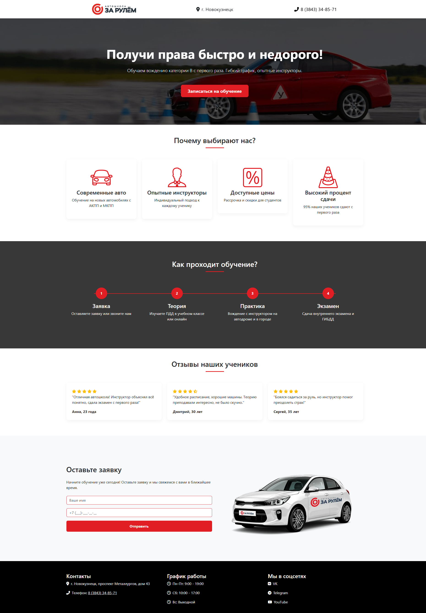

# Лендинг для автошколы 
 
## 📝 О проекте
Это учебный проект, выполненный в рамках обучения в ГПОУ ПК г. Новокузнецк. 
Представляет собой одностраничный сайт (лендинг) для автошколы "За рулем".

## 🛠 Технологии
- HTML5
- CSS3 
- JavaScript 
- Адаптивная верстка (под мобильные устройства)

## 📂 Структура проекта
- `index.html` — главная страница
- `css/` — папка со стилями
- `js/` — папка со скриптами
- `img/` — изображения

