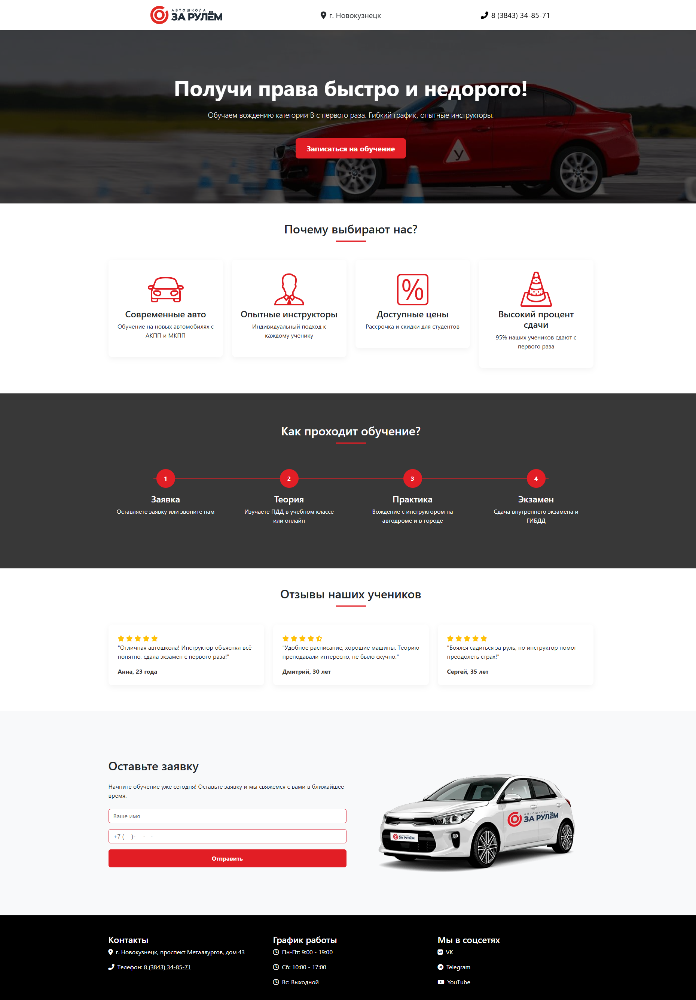
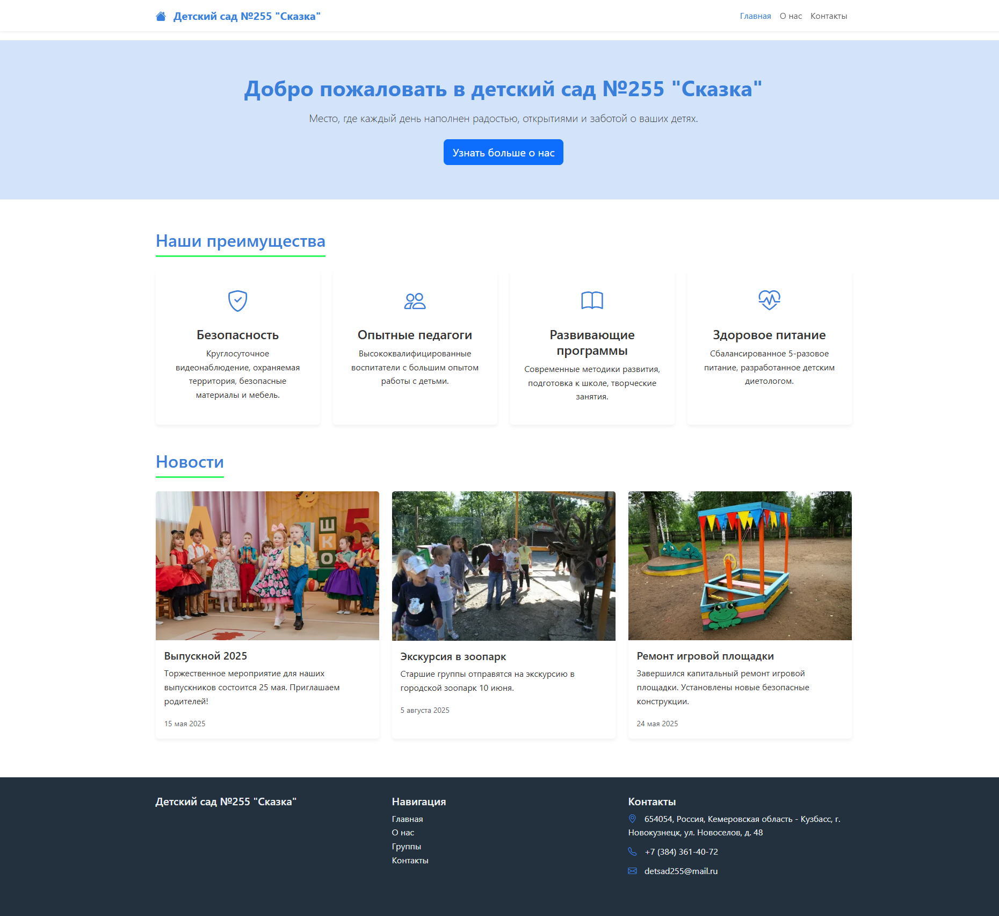
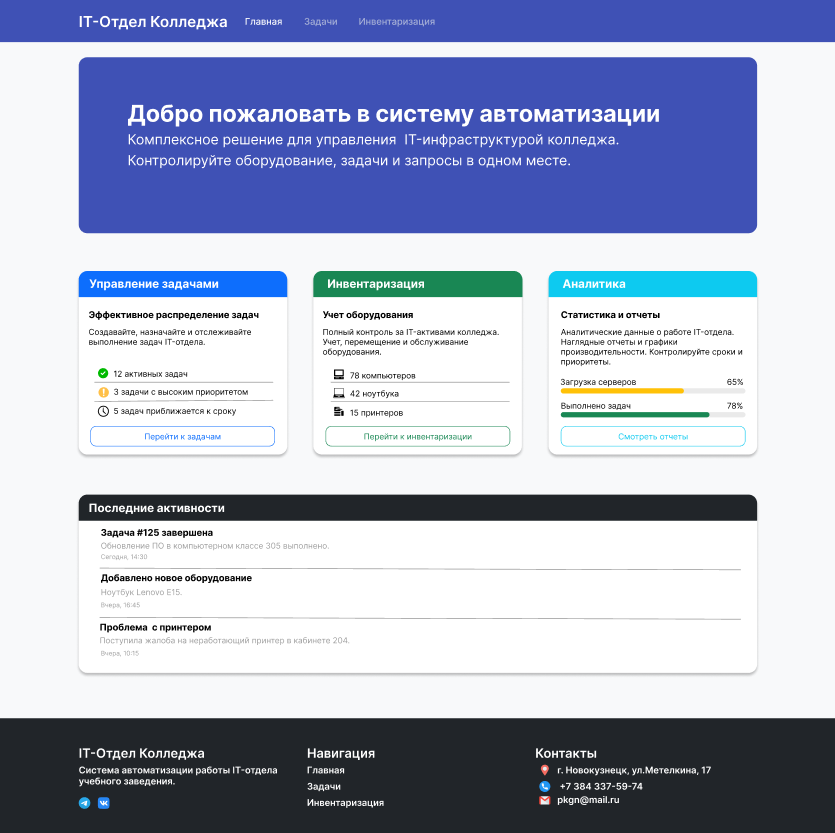
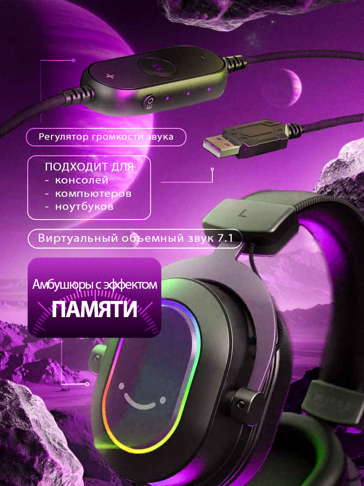
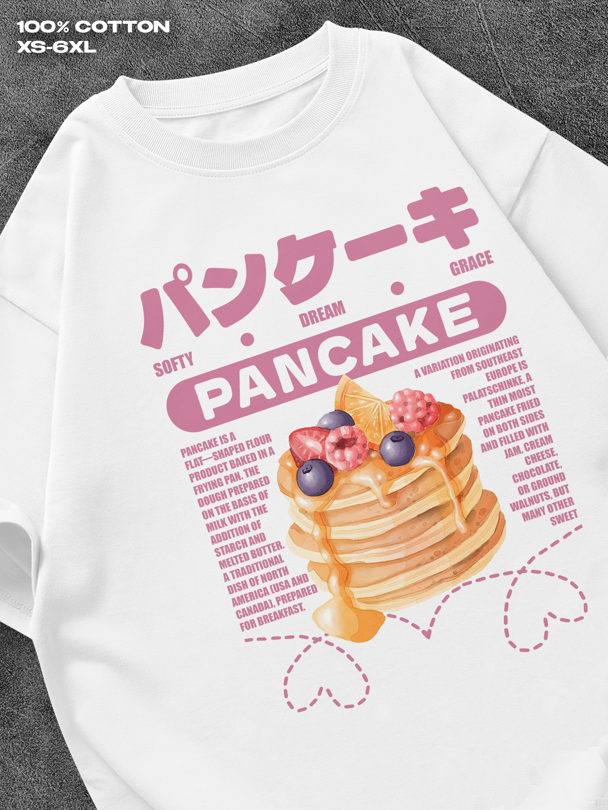
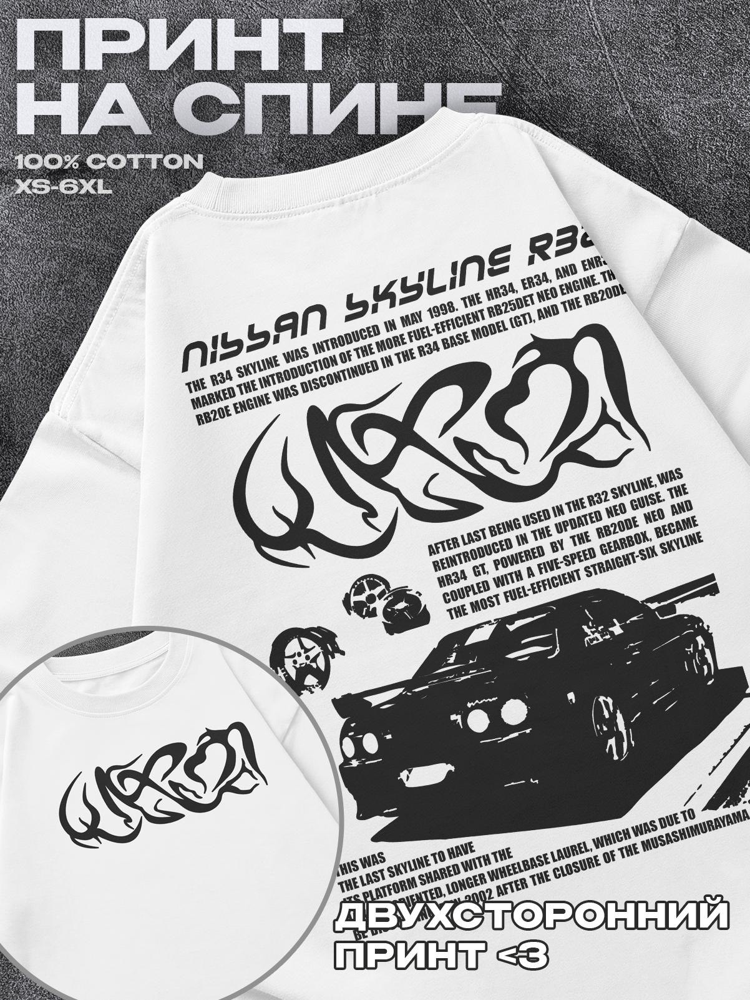

# Лендинг для автошколы (производственная практика)🏫
*Нажмите на изображение, чтобы просмотреть сайт*

## 📝 О проекте
Это учебный проект, выполненный в рамках обучения в ГПОУ ПК г. Новокузнецк им. Кучерявенко Т.А. . 
Представляет собой одностраничный сайт (лендинг) для автошколы "За рулем".

## 🛠 Технологии
- HTML5
- CSS
- JavaScript 
- Адаптивная верстка (под мобильные устройства)

# Сайт для детского сада (производственная практика)🏫
*Нажмите на изображение, чтобы просмотреть сайт*

## 📝 О проекте
Этот сайт был разработан в рамках производственной практики в ГПОУ ПК г. Новокузнецк им. Кучерявенко Т.А. 
Представляет собой многостраничный сайт для детского сада с адаптивным дизайном.

## 🛠 Технологии
- HTML5
- CSS
- JavaScript (валидация для формы заявок)
- Адаптивная верстка (для планшетов и мобильных устройств)

# 🎯 Прототип сайта для IT-отдела колледжа в Figma
*Нажмите на изображение, чтобы просмотреть интерактивный прототип в Figma*

# 🎨 Разработка дизайна карточек для товара на маркетплейсы (для работы использовался Photoshop)
     

# 🎨 Разработка дизайна принтов для футболок (маркетплейсы) (для работы использовался Photoshop, Illustrator)
        

